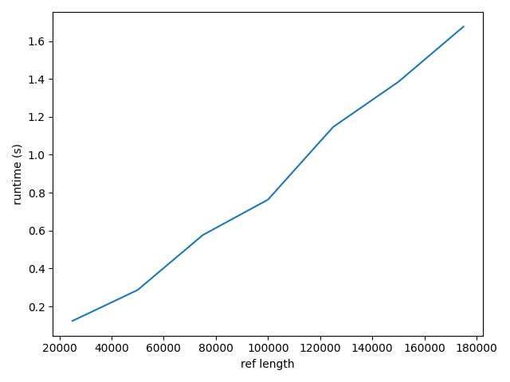
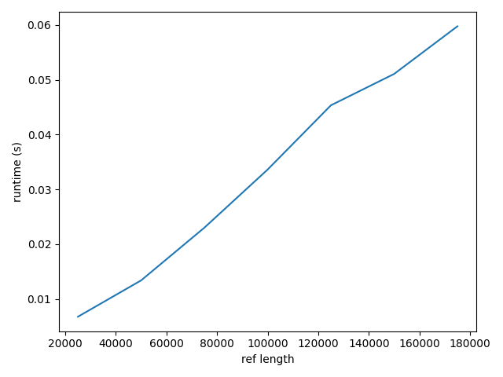
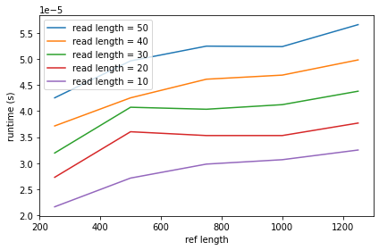
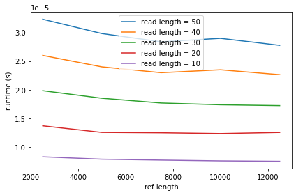

# Project 3: Suffix array construction

You should implement a suffix array construction algorithm. You can choose to implement the naive O(n² log n)-time construction algorithm based on just sorting all the suffixes using a comparison based algorithm, the O(n²) algorithm you get if you radix sort the suffixes, or you can use the suffix tree from project 2: If you run through the suffix tree, and traverse children in lexicographical order, you will see each leaf in lexicographical order as well, and if you collect all the leaf-labels you have your suffix array.

If you feel adventurous, you are also welcome to implement one of the linear time algorithms *skew* or *SAIS* that we will see the next two weeks, but then you will have to read a bit ahead.

Once you have constructed a suffix array you should use it to implement a binary-search based exact pattern matching. Since I haven’t taught you have to do it faster, it should run in O(m log n + z) where m is the length of the pattern, n is the length of the genome string, and z is the number of matches you output. (One of the algorithms you have seen multiplies z by m, but you know how to avoid this).

Implement the suffix array construction and the exact pattern matching in a single program called `sa`.  The program should take the same options as in project 1, so `sa genome.fa reads.fq`. The program should output (almost) the same Simple-SAM file. Because a search in a suffix array is not done from the start to the end of the string the output might be in a different order, but if you sort the output from the previous project and for this program, they should be identical.

## Evaluation

Once you have implemented the `sa` program (and tested it to the best of your abilities) fill out the report below, and notify me that your pull request is ready for review.

# Report

## Algorithm

*Which algorithm did you use to construct the suffix array. What is its running time?*

# ANWSER (Algorithm):
I used Prefix-doubling.
The doubling of prefixes (in each iter) gives a max of log(n) iterations and since bucket-sort is O(n) per iteration we have a total running time of O(nlog(n)).
I haven't implemented the bucket/radix-sort 'yet' so i guess the running time of my implementation is O(nlog(n)2) for now.

## Insights you may have had while implementing the algorithm

# ANWSER (Insights):
I found out that SA's are really cleaver, SA-IS is a motherfucker to implement and prefix doubling is a very nice (and simple) little algorithm. 

## Problems encountered if any

# ANWSER (Problems):
I found Radix-sorting my list of tuples pretty hard. I actually think i made it work but it was still slover than my old implementation (which i in the meantime simplified a lot) so i went back. 

## Validation

*How did you validate that the construct and the search algorithm works?*

# ANWSER (Validation):
I compared my SA implementation against a naive SA algorithm constantly while building it (see sa.py; get_suffix_array()). Likewise i compared the output of my exact-pattern-algorithm with a pattern-finder based on re.finditer() (see Runtimes.py; re_find()) 500000 times on randomly generated DNA-strings. 

## Running time

*List experiments and results that show that both the construction algorithm and the search algorithm works in the expected running time. Add figures by embedding them here, as you learned how to do in project 1.*

# ANWSER (searching tree):

SA construction:

SA construction (y/log10(x)):

Seems like my algorithm runs nlog(n)? 
(maybe i just need a larger example to see the other log(n))..

Runtimes for varying read lengths:

Runtimes for varying read lengths (y/log2(x)):

So the runtimes for varying read lengths seems more linear than nlog(m) ish to me (which is its theoretical search time). 
Probably this is because the log(m) is pretty negligible for patterns this short (though reads >200 to 1200 is not short for seq reads). 
I don't know how it is usually done but in my implementation i search the SA for other occurrences left/right from first discovered pattern with respect to SA position. This means that it is only the first discovery which takes nlog(m) all other incidents should be O(n). 

